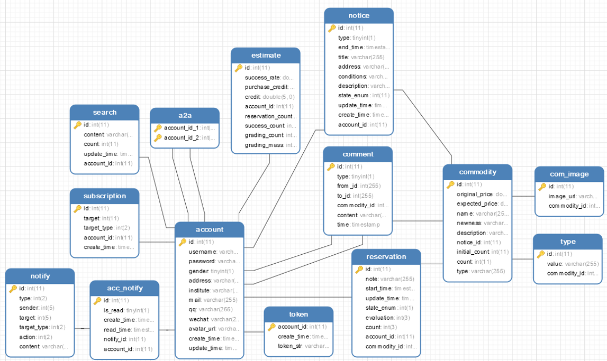

## 1.引言

### 1.1 编写目的

​		本文档是概要设计文档的组成部分，编写数据库设计文档的目的是：明确数据库的表名、字段名、数据类型、约束条件等信息，用来指导后期的数据库脚本的开发，本文档遵循《数据库设计和开发规范》。

### 1.2 适用对象

​		本数据库设计文档提供给系统设计开发人员，包括前端界面构建成员以及后端逻辑实现成员，同时会作为依据和参考，为系统测试阶段提供文档支持。

## 2.数据库环境说明

​		本项目数据库由Mysql关系型数据库管理系统建立并维护。数据库设计过程中使用Navicat数据库管理工具对数据表进行创建、修改、删除等操作，该工具可以导出或运行sql文件，极大地简化了数据库的建立和管理。同时，利用该工具可以查看数据库数据表之间的关联关系，简洁方便。

## 3.数据库命名规则

​	本项目数据库设计满足以下规则：

- 主键外键关系、表间关系、表中字段是不可再分的属性；
- 表的功能划分合理；
- 字段的命名、类型和长度合理；
- 数据表均以小写命名，比较直观；
- 对于联系两张表的中间数据表，名字以下划线间隔，如：acc_notify。

## 4.逻辑设计

​		本系统的数据库按照面向对象的思想，设计对应实体类，由实体类生成对应的数据库表，数据表之间的关系，反映了对象间的关系。

## 5.数据库实现

​		本系统数据库共包含十三个数据表。

### 5.1 a2a

​		该数据表主要用来控制哪些用户有权限互相聊天，只有双方完成预约后才会开通私聊通道。

|              | 字段类型 | 字段含义 |
| ------------ | -------- | -------- |
| account_id_1 | int      | 用户1    |
| account_id_2 | int      | 用户2    |

### 5.2 acc_notify

​		用户通知列表，该数据表联系通知表和用户表，用于通知消息提醒。

|             | 字段类型 | 字段含义   |
| ----------- | -------- | ---------- |
| id          | int      | 主键       |
| is_read     | tinyint  | 是否已读   |
| create_time | datatime | 创建时间   |
| read_time   | datatime | 已读时间   |
| notify_id   | int      | 通知表外键 |
| account_id  | int      | 用户表外键 |

### 5.3 account

​		用户表，存储用户信息。

|              | 字段类型 | 字段含义                   |
| ------------ | -------- | -------------------------- |
| id           | int      | 主键                       |
| username     | varchar  | 用户名                     |
| password     | varchar  | 密码                       |
| gender       | tinyint  | 性别，0表示女性，1表示男性 |
| address      | varchar  | 地址                       |
| instiute     | varchar  | 学院                       |
| mail         | varchar  | 邮箱                       |
| qq           | varchar  | QQ账号                     |
| wechat       | varchar  | 微信号                     |
| avatar       | varchar  | 头像地址                   |
| create_time  | datetime | 账号创建时间               |
| update_time  | datetime | 用户信息更新时间           |
| introduction | varchar  | 描述                       |

### 5.4 com_image

​		商品图片表，保存有关商品的图片。

|              | 字段类型 | 字段含义   |
| ------------ | -------- | ---------- |
| id           | int      | 主键       |
| image_url    | varchar  | 图片地址   |
| commodity_id | int      | 商品表主键 |

### 5.5 comment

​		评论数据表，保存有关商品的评论信息。

|              | 字段类型  | 字段含义                   |
| ------------ | --------- | -------------------------- |
| id           | int       | 主键                       |
| type         | tinyint   | 类型，0代表评论，1代表回复 |
| from_id      | int       | 发送者                     |
| to_id        | int       | 接受者                     |
| commodity_id | int       | 商品表外键                 |
| content      | varchar   | 评论内容                   |
| date         | timestamp | 评论时间                   |

### 5.6 commodity

​		商品表，存储商品相关信息。newness为枚举值，0,1,2,3分别代表5成新，7成新，9成新和全新。

|                | 字段类型 | 字段含义     |
| -------------- | -------- | ------------ |
| id             | int      | 主键         |
| original_price | double   | 原始价格     |
| expected_price | double   | 期望出售价格 |
| name           | varchar  | 商品名称     |
| newness        | int      | 折旧程度, 如 |
| description    | varchar  | 商品描述     |
| notice_id      | int      | 通告表外键   |
| initial_count  | int      | 商品原始数量 |
| count          | int      | 商品目前数量 |
| type           | varchar  | 商品种类     |

### 5.7 estimate

​		信誉表，用来记录用户交易成功率和信誉情况。

|                   | 字段类型 | 字段含义   |
| ----------------- | -------- | ---------- |
| id                | int      | 主键       |
| success_rate      | double   | 交易成功率 |
| purchase_credit   | double   | 购入信用   |
| credit            | double   | 卖出信用   |
| account_id        | int      | 用户表外键 |
| reservation_count | int      | 预约数量   |
| success_count     | int      | 成功数     |
| grading_cout      | int      | 出售商品数 |
| grading_mass      | int      | 出售金额   |

### 5.8 notcie

​		通告表，用于保存出售方发布的卖出物品通告。

|                  | 字段类型  | 字段含义     |
| ---------------- | --------- | ------------ |
| id               | int       | 主键         |
| type             | tinyint   | 通告类型     |
| end_time         | timestamp | 截止日期     |
| title            | varchar   | 标题         |
| address          | varchar   | 具体交易地址 |
| condition        | varchar   | 具体交易条件 |
| description      | varchar   | 描述         |
| state_enum       | int       | 状态         |
| update_time      | timestamp | 更新日期     |
| create_time      | timestamp | 创建日期     |
| owner_id         | int       | 创建者       |
| detailed_address | varchar   | 详细地址     |
| browse_count     | int       | 浏览量       |

### 5.9 notify

​		通知表，保存消息通知。

|             | 字段类型 | 字段含义                         |
| ----------- | -------- | -------------------------------- |
| id          | int      | 主键                             |
| type        | int      | 通知类型，评论或                 |
| sender      | int      | 发送者                           |
| target      | int      | 目标                             |
| target_type | int      | 目标类型，比如评论、预定等       |
| action      | int      | 动作类型，0表示预定，1表示取消等 |
| content     | int      | 通知内容                         |

### 5.10 reservation

​		预定表，保存交易信息。

|                 | 字段类型  | 字段含义   |
| --------------- | --------- | ---------- |
| id              | int       | 主键       |
| note            | varchar   | 留言       |
| start_time      | timestamp | 开始日期   |
| update_time     | timestamp | 完成日期   |
| state_num       | int       | 状态       |
| evaluation      | int       | 交易评估   |
| count           | int       | 数量       |
| account_id      | int       | 用户表外键 |
| commodity_id    | int       | 商品表外键 |
| evaluation_buy  | decimal   | 买家评分   |
| evaluation_sell | decimal   | 卖家评分   |

### 5.11 search

​		历史搜索记录表，保存用户的搜索记录。

|             | 字段类型 | 字段含义   |
| ----------- | -------- | ---------- |
| id          | int      | 主键       |
| content     | varchar  | 内容       |
| count       | int      | 搜索次数   |
| create_time | datetime | 创建日期   |
| update_time | datetime | 更新日期   |
| account_id  | int      | 用户表外键 |

### 5.12 subscription

​		订阅表，与Notify数据表结合使用，实现消息队列。

|             | 字段类型 | 字段含义   |
| ----------- | -------- | ---------- |
| id          | int      | 主键       |
| target      | int      | 目标       |
| target_type | int      | 目标类型   |
| account_id  | int      | 用户表外键 |
| create_time | datetime | 创建日期   |

## 5.13 token

​		token数据表，用于用户身份的验证。

|             | 字段类型  | 字段含义  |
| ----------- | --------- | --------- |
| account_id  | int       | 用户id    |
| create_time | timestamp | 创建日期  |
| token_str   | varchar   | token序列 |

### 5.14 type

​		类型表，存储商品类型字段。

|              | 字段类型 | 字段含义                 |
| ------------ | -------- | ------------------------ |
| id           | int      | 主键                     |
| value        | varchar  | 类型分类，如书籍、电子等 |
| commodity_id | int      | 商品表外键               |

## 6.ER图展示

