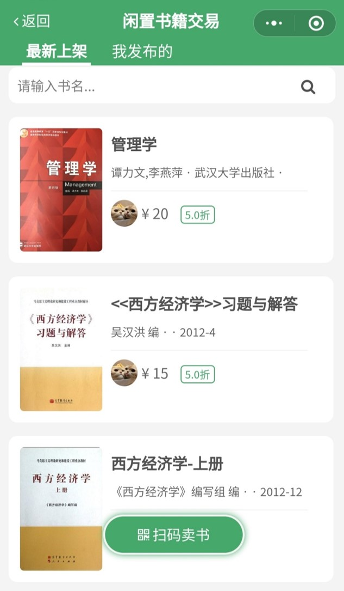

## 1. 引言

### 1.1 编写目的

**本文档编写基于下述准则**:

(1) 理解并分析问题的信息域, 根据此建立对应的数据模型.

(2) 定义软件需要完成的功能, 并以此建立功能模型.

(3) 描述作为外部事件结果的软件行为, 建立相关的行为模型.

(4) 对描述数据、功能和行为的模型进行分解, 用层次的方式展示模型的各种细节.

(5) 方便用户和开发者之间的交流, 为软件开发工作提供了基础和用于测试验收的依据.

### 1.2 项目背景

- 项目名称：校园二手交易平台
- 项目提出者：陈炳生、曾志昊、高战立、马如云
- 项目开发者：陈炳生、曾志昊、高战立、马如云
- 用户：国内大学校园内的学生
- 项目开发单位：武汉大学计算机学院
- 项目简介：
  1. 当前，在校大学生一般是以集体的宿舍生活为主，学生很多时候会因为一时的需求去购买一些物品，而这些物品在用过一段时间后对本人来说基本上失去了价值。 
  2. 如果此时直接丢弃，对于学生来说不免有些浪费，因为部分物品并不便宜，例如一些在某门课上课时需要的书籍、寝室里的生活小用品、换新机时的旧手机等等。所以大学生一般会想办法将自己的二手物品卖出去，对于卖方来说得到了一些报酬且清理了旧物，对于买方来说能够以低于正常市场价的价格收到想要的东西。
  3. 因此，大学校内一般存在着很多这样那样的供需群，包括QQ/微信群，群成员在群里用聊天的方式表达自己的需求（可以是提供或者求某件物品，可以是实物或者虚拟物品），群里其他成员看到了可以主动去联系
  4. 但是上述的一些现有方式存在着不少的问题，包括但不限于下述几种：
     - 各个平台较分散
     - 生效时间模糊
     - 缺乏分类组织
     - 信息混乱（QQ群中除了需求信息外还有其他的聊天信息混入）
     - 信息更新不及时不连续
     - 记录丢失
- 项目目的：开发出一款综合性的**校园二手交易平台**，能够将分散的需求通告聚集起来，统一组织和管理，方便学生进行筛选和查找，从而使校园间的这种二手交易更加轻松、方便和可靠。
- 项目说明：该平台的项目说明书的编写目的是尽可能详细地描述出该项目的启动背景、需求分析的过程、功能设计与实现的展示以及项目测试的结果。为概要设计和详细设计人员提供设计依据, 供本项目的其他开发人员参阅，也可帮助用户了解系统的功能和用法. 本项目报告的目的是使本平台的设计和开发过程文档化, 旨在于提高软件开发过程中的能见度, 便于对软件开发过程中的控制与管理, 同时便于开发人员与客户之间的交流与协作, 并作为工作成果的原始依据。

### 1.3 平台对比

我们对比了现有的三个功能类似的平台：

#### 1.3.1 在武大小程序

该小程序中存在一个单独的板块——闲置书籍，专门用于校内二手书籍的交易。通过出售者发布一个通知，附上自己的联系方式来与想要买入二手书的同学提供联系的桥梁。

存在的**问题**：

1. 筛选条件不足
2. 缺乏交易记录管理
3. 无法对用户行为和系统行为进行对应的通知

#### 1.3.2 闲鱼

是阿里巴巴集团旗下的二手交易平台，采用类似淘宝的电商模式运营，其涵盖的用户范围比较广，类别比较全，UI界面也是很值得借鉴的

存在的**问题**：

1. 没有专门面向对大学生这一群体
2. 需求信息多而杂

#### 1.3.3 QQ群/群相册

据我们的调查，QQ群方式是现在大学生最常用、也是被认为最方便的交易方式，因为他背靠聊天系统，交流方便

存在的**问题**：

1. 信息更新不便
2. 需求信息被其他信息给“刷掉”
3. 交易记录没有被统一管理，难以查找

### 1.4 参考文献

[1]. 黄雪华 徐述 曹步文 黄静 著. 数据库原理及应用（第4版）清华大学出版社

[2]. 张海藩, 牟永敏 著. 软件工程导论 (第6版) 北京: 清华大学出版社

[3]. 梁灏 著. Vue.js实战（第2版） 清华大学出版社

### 1.5 小组成员及分工

| 成员名称 | 角色 | 负责部分                                                     |
| -------- | ---- | ------------------------------------------------------------ |
| 陈炳生   | 组长 | 需求分析、数据库设计、前端界面设计和开发、系统测试、项目博客整理与维护 |
| 曾志昊   | 组员 | 需求分析、数据库设计与完善、后端业务开发、后台单元测试、集成测试 |
| 高战立   | 组员 | 需求分析、数据库设计与完善、后端业务开发、后台单元测试、集成测试 |
| 马如云   | 组员 | 需求分析、数据库设计、前端开发、系统测试                     |

