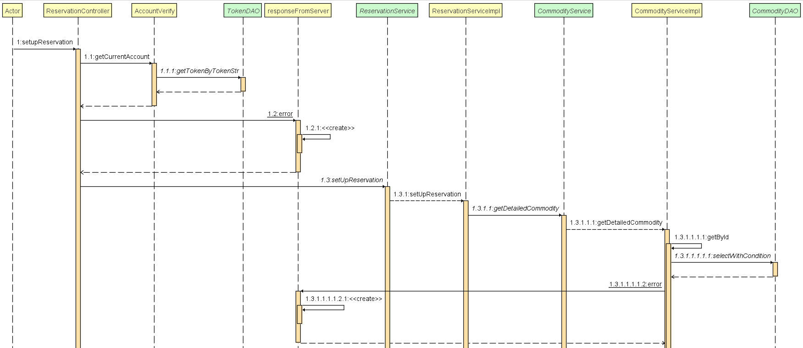

# 后端
## 1. 项目框架

本项目后端实现所采用的框架为：SpringBoot + Mybatis Plus + MySQL ，除此之外，本项目配置了log4j2日志，以记录和管理本系统输出日志，便于后期维护；加入了swagger模块，以更好的展现后端API接口；添加了redis实现，以提高重复查询效率。

后端实现模块划分为config（配置文件）、controller（控制器）、dao（数据访问层）、intercepter（拦截器）、pojo（实体类）、service（服务层）以及util（工具类）等模块，层次分明，逻辑划分清晰。模块预览如下：


## 2. 核心算法

后端部分主要是对诸多数据表进行查询、插入、删除、更新等操作，实现较为繁琐但并不复杂，该项目核心部分主要是：拦截器、消息机制以及预约功能实现。

### 2.1 消息机制

消息机制是后端项目一个较为核心的算法，商品被预约、评论、评论被回复、通告失效等信息的通知，均是通过消息机制实现的。以下为消息通知的例子：

- a 预约了 你的 b 商品；
- a 取消了预约 (b)；
- a评论了你的商品(b)。

以上提醒消息格式可归纳为：

> 「谁对一样属于谁的事物做了什么操作」
> 「someone do something in someone's something」

- someone = 提醒的触发者，或者发送者，标记为sender；
- do something = 提醒的动作，预约、取消、评论都属于一个动作，标记为action；
- something = 提醒的动作作用对象，这就具体到是哪一个商品，标记为target；
- someone's = 提醒的动作作用对象的所有者，标记为targetOwner。

当用户登录时，会根据用户Id检索通知数据表，对未读的通知进行提醒；针对用户在线时接收到消息的情况，本项目利用websocket实现动态消息提醒。通知服务实现关联如下：


### 2.2 预约功能

每个用户均可以发布商品或者预约心仪的商品，每一个商品都会有一个预约队列，用户发起预约后，系统会将用户的相关信息保存至商品的预约队列中，等候发布者处理。预约请求被划分为六个状态，分别是：失败、取消、等待中、已确认、完成、等待失败，预约等待过程中，用户可以随时取消预约。下面以创建预约为例，详细讲述预约实现过程。

当用户点击预约按钮后，后端系统接收到该请求，首先调用getCurrentAccount函数，根据请求附带的HttpServletRequest获取到发起预约的用户信息。然后根据预约信息获取到该商品的id，查询该商品的数量，如果该商品不存在或者数量为0，则返回错误信息。商品数量足够时，系统设置订单的预约用户id以及订单状态等信息，并对商品发布者进行消息提醒。创建预约流程图如下:




## 3. 拦截验证

​	我们使用拦截器来处理所有的请求，自定义loginInterCeptor，实现HandlerInterceptorAdapter在preHandle中，为路径中包含以下地址的请求放行，其余的请求路径均需要进行登录验证。

``` java
 if (arg0.getRequestURI().contains("/login")
                || arg0.getRequestURI().contains("/register")
                || arg0.getRequestURI().contains("/static")
                || arg0.getRequestURI().contains("/test")) {
            return true;
        }
```

​	我们采用token的方式来维护用户的登录状态，在用户初次登录时，系统校验用户账号密码，成功后给其生成一个token，token=用户ID+时间戳+tokenStr签名，用户请求时将token放在请求头中，

``` java
final String headerToken = arg0.getHeader("token");
```

​	如果没有token则视为未登录，拿到token后则到数据库中查询验证。

​	如下图所示，我们定义了token实体类，以及对应的dao。


## 4. RESTful API：Swagger

本项目后端接口设计符合RESTful API的思想，浏览器使用POST，DELETE，PUT和GET四种请求方式分别对指定的URL资源进行增删改查操作，通过URI实现对资源的管理及访问，具有扩展性强、结构清晰的特点。

本项目后端API总览：


以AccountController为例展现 API列表：

