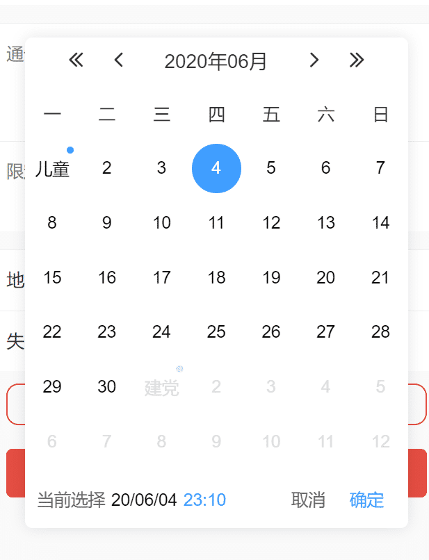
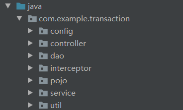

# 前端

## 一、初始界面

### 1、登录界面

**前端功能实现：**

- 输入用户名密码，立即登录到首页界面

**系统功能实现：**

- 登录用户根据角色不同所拥有的权限不同


### 2、注册界面

**前端功能实现：**

- 输入和核验相关信息后完成新用户注册进入主界面

- 点击返回登录返回登录界面

- 显示或隐藏登录密码

**系统功能实现：**

- 检验用户名是否未被注册过

- 命令服务器向用户发送验证码

- 检验验证码是否正常

- 检验是否同意用户协议

- 上传新用户的用户名、登录密码、微信号、地区、邮箱信息


### 3、找回密码界面

**前端功能实现：**

- 显示或隐藏新密码

- 点击返回登录返回登录界面

- 点击重置密码后返回登录界面

**系统功能实现：**

- 命令服务器向用户发送验证码

- 点击重置密码，将新的密码更新至服务器


## 二、物品界面

### 1、主界面

**前端功能实现：**

- 点击搜索框跳转至搜索界面

- 滑动轮播图

- 点进分类进入筛选界面

- 按照不同推荐选项卡显示不同商品

- 点击商品进入商品详情页

- 点击屏幕下方选项卡分别进入通告、发布、消息、我的界面

**系统功能实现：**

- 加载轮播图图片

- 根据服务器储存的商品信息显示商品预览图、名称、价格、卖家头像、卖家用户名、库存情况、预约信息

- 根据服务器储存的标签显示不同分类标签和图标

- 加载下方选项卡图标和名称

- 下拉刷新

- 触底时向服务器发送新的请求


### 2、搜索界面

**前端功能实现：**

- 返回箭头能返回上一个界面

- 搜索框输入搜索信息

- 点击搜索向服务器发送筛选商品的请求

- 点击搜索下拉菜单显示具体分类，点击分类后向服务器发送筛选商品的请求

- 向本地储存获取用户的历史搜索信息并显示

- 删除本地的历史搜索信息

**系统功能实现：**

- 向服务器获取推荐搜索信息并显示

- 向服务器发送筛选商品的请求

- 向服务区获取商品的分类信息并且储存在下拉菜单中

- 显示收到的商品缩略图、价格、原价、预约人数、卖家头像、卖家用户名、库存件数

- 触底时向服务器发送新的请求


### 3、商品详情界面

**前端功能实现：**

- 滑动轮播图

- 点击图片显示大图，并且能够左右滑动

- 点击返回箭头返回上一页

- 填写预约信息：备注、购买件数

- 点击查看通告进入商品属于的通告详情

- 点击卖家头像名称进入卖家信息

- 如果用户为卖家，则底部显示更新信息

**系统功能实现：**

- 向服务器获取商品的具体信息并显示

- 发送评论并储存在服务器上

- 点击立即预约向服务器发送预约请求

- 向服务器发送预约信息

- 向服务器更新商品信息


### 4、用户信息界面

**前端功能实现：**

- 点击商品缩略图进入商品详情

- 点击返回箭头返回上一页

- 滑动商品列表

**系统功能实现：**

- 向服务器获取用户信息并显示


## 三、通告界面

### 1、主界面

**前端功能实现：**

- 点击最上方选项卡筛选通告

- 点击通告进入通告详情界面

- 点击图片显示大图，并且能够左右滑动

- 点击卖家头像名称进入卖家信息界面

**系统功能实现：**

- 向服务器获取不同类别的通告信息并显示

- 下拉刷新

- 触底时向服务器发送新的请求


### 2、通告详情

**前端功能实现：**

- 点击卖家头像名称进入卖家详情界面

- 点击商品进入商品详情

**系统功能实现：**

- 向服务器获取通告详细信息并显示


## 三、发布界面

### 1、主界面

**前端功能实现：**

- 点击三种发布通告进入不同界面

**系统功能实现：**


### 2、发布出售、需求、任务通告界面

**前端功能实现：**

- 填写相应信息

- 任务通告没有添加物品按钮

- 点击添加物品进入添加物品界面

- 检查信息是否填写完整

- 点击返回能够返回上一个界面

- 选择日期弹出选择日期弹窗

**系统功能实现：**

- 点击确认发布将相应信息存入服务器




### 3、添加新物品界面

**前端功能实现：**

- 点击选择分类弹出列表供选择

- 填写物品相应信息

- 点击上传图片选择图片储存地址

- 点击添加将物品信息加入通告详细信息中

- 点击返回回到上一页

**系统功能实现：**

- 向服务器请求分类和新旧标签并加载


## 五、消息界面

### 1、主界面

**前端功能实现：**

- 点击消息标签显示不同类型的消息

- 点击完成的交易通知进入交易详情界面

- 点击用户头像名称进入用户详情界面

- 点击商品缩略图进入商品详情界面

- 右滑消息可以标记已读

- 未读的消息右上角会有红色小点

**系统功能实现：**

- 向服务器请求用户的消息信息并显示

- 向服务器更新用户的已读情况

- 上拉刷新


### 2、交易详情界面

**前端功能实现：**

- 按照不同的交易进度显示相应的图标状态

- 已预约后卖家可以点击确认交易

- 卖家未确认交易时买家可以点击取消交易

- 点击商品缩略图可以进入商品详情界面

- 点击用户头像名称可以进入用户详情界面

- 点击返回箭头可以返回上一页

- 交易完成后交易双方可以点击更新评价对本次交易进行评分

**系统功能实现：**

- 向服务器获取交易信息详情并显示

- 点击取消交易和确认交易按钮可以向服务器可以更新交易状态

- 向服务器更新评价星级


## 六、消息界面

### 1、主界面

**前端功能实现：**

- 点击右上角图标进入修改密码界面

- 点击我的预约进入我的预约列表

- 点击我的发布进入我的发布列表

- 点击我的通告进入我的通告列表

- 点击用户信息右边的箭头可以更新用户信息

- 选择性别

- 填写个人简介

- 填写昵称

- 填写地址信息

- 查看关于

- 填写联系卡

- 点击注销账户退出登录

 **系统功能实现：**

- 向服务器获取用户信息详情并显示

- 向服务器更新用户信息

- 上传头像


### 2、我的发布界面

**前端功能实现：**

- 点击商品进入商品详情页面

- 点击返回按钮返回上一页

**前端功能实现：**

- 向服务器请求我发布的商品详情信息并显示

- 下拉刷新


### 3、我的预约界面

**前端功能实现：**

- 点击不同标签显示不同属性的预约列表

- 点击预约列表进入预约详情页

- 点击返回箭头返回上一个界面

**系统功能实现：**

- 向服务器请求我的预约信息详情并显示

- 下拉刷新


# 后端

## 1. 项目框架

本项目后端实现所采用的框架为：SpringBoot + Mybatis Plus + MySQL ，除此之外，本项目配置了log4j2日志，以记录和管理本系统输出日志，便于后期维护；加入了swagger模块，以更好的展现后端API接口；添加了redis实现，以提高重复查询效率。

后端实现模块划分为config（配置文件）、controller（控制器）、dao（数据访问层）、intercepter（拦截器）、pojo（实体类）、service（服务层）以及util（工具类）等模块，层次分明，逻辑划分清晰。模块预览如下：



## 2. 核心算法

后端部分主要是对诸多数据表进行查询、插入、删除、更新等操作，实现较为繁琐但并不复杂，该项目核心部分主要是：拦截器、消息机制以及预约功能实现。

### 2.1 消息机制

消息机制是后端项目一个较为核心的算法，商品被预约、评论、评论被回复、通告失效等信息的通知，均是通过消息机制实现的。以下为消息通知的例子：

- a 预约了 你的 b 商品；
- a 取消了预约 (b)；
- a评论了你的商品(b)。

以上提醒消息格式可归纳为：

> 「谁对一样属于谁的事物做了什么操作」
> 「someone do something in someone's something」

- someone = 提醒的触发者，或者发送者，标记为sender；
- do something = 提醒的动作，预约、取消、评论都属于一个动作，标记为action；
- something = 提醒的动作作用对象，这就具体到是哪一个商品，标记为target；
- someone's = 提醒的动作作用对象的所有者，标记为targetOwner。

当用户登录时，会根据用户Id检索通知数据表，对未读的通知进行提醒；针对用户在线时接收到消息的情况，本项目利用websocket实现动态消息提醒。通知服务实现关联如下：


### 2.2 预约功能

每个用户均可以发布商品或者预约心仪的商品，每一个商品都会有一个预约队列，用户发起预约后，系统会将用户的相关信息保存至商品的预约队列中，等候发布者处理。预约请求被划分为六个状态，分别是：失败、取消、等待中、已确认、完成、等待失败，预约等待过程中，用户可以随时取消预约。下面以创建预约为例，详细讲述预约实现过程。

当用户点击预约按钮后，后端系统接收到该请求，首先调用getCurrentAccount函数，根据请求附带的HttpServletRequest获取到发起预约的用户信息。然后根据预约信息获取到该商品的id，查询该商品的数量，如果该商品不存在或者数量为0，则返回错误信息。商品数量足够时，系统设置订单的预约用户id以及订单状态等信息，并对商品发布者进行消息提醒。创建预约流程图如下:


## 3. 拦截验证

​	我们使用拦截器来处理所有的请求，自定义loginInterCeptor，实现HandlerInterceptorAdapter在preHandle中，为路径中包含以下地址的请求放行，其余的请求路径均需要进行登录验证。

``` java
 if (arg0.getRequestURI().contains("/login")
                || arg0.getRequestURI().contains("/register")
                || arg0.getRequestURI().contains("/static")
                || arg0.getRequestURI().contains("/test")) {
            return true;
        }
```

​	我们采用token的方式来维护用户的登录状态，在用户初次登录时，系统校验用户账号密码，成功后给其生成一个token，token=用户ID+时间戳+tokenStr签名，用户请求时将token放在请求头中，

``` java
final String headerToken = arg0.getHeader("token");
```

​	如果没有token则视为未登录，拿到token后则到数据库中查询验证。

​	如下图所示，我们定义了token实体类，以及对应的dao。


## 4. RESTful API：Swagger

本项目后端接口设计符合RESTful API的思想，浏览器使用POST，DELETE，PUT和GET四种请求方式分别对指定的URL资源进行增删改查操作，通过URI实现对资源的管理及访问，具有扩展性强、结构清晰的特点。

本项目后端API总览：


以AccountController为例展现 API列表：

